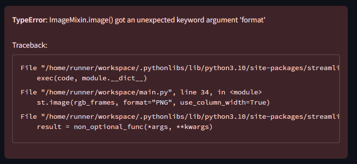

# Face Morphing Demo / 顔画像モーフィングデモ

画像間で顔の特徴点を検出し、自然な変形アニメーションを生成するStreamlitウェブアプリケーション。
A Streamlit web application that generates natural face morphing animations by detecting facial landmarks between images.

## デモ / Demo



## 特徴 / Features

- 2枚の画像間でリアルタイムモーフィング
- MediaPipe Face Meshによる高精度な顔特徴点検出
- スライダーによる変形度合いの調整
- ローカル処理による安全な画像処理
- エラーハンドリングによる安定動作

## 技術仕様 / Technical Specifications

- **Python 3.10**
- **Streamlit**: インターフェース構築
- **OpenCV**: 画像処理エンジン
- **MediaPipe**: 顔特徴点検出
- **NumPy**: 数値計算処理

### 処理の流れ / Process Flow

1. **顔検出**: MediaPipe Face Meshで両画像の特徴点を検出
2. **三角形分割**: Delaunay分割で対応点を三角形化
3. **変形処理**: 三角形ごとにアフィン変換を適用
4. **ブレンド**: 変形画像間をクロスディゾルブ

## ディレクトリ構造 / Directory Structure

```
.
├── .config/
│   └── matplotlib/
├── .streamlit/
│   └── config.toml
├── attached_assets/
│   └── image_1745303792519.png
├── docs/
│   ├── FaceVectorLab-Streamlit.md
│   └── TechSpecSheet.md
├── main.py            # Streamlit UI
├── morph.py          # 画像処理ロジック
├── pyproject.toml    # Poetry設定
└── README.md         # 本ドキュメント

```

## インストール / Installation

Poetry による依存関係管理:

```bash
# Poetryがインストール済みの場合
poetry install
```

必要なパッケージ:
- streamlit
- opencv-python
- mediapipe
- numpy

## 使い方 / Usage

1. Replitの実行ボタンをクリックしてサーバーを起動
2. 画像をアップロード:
   - "元画像": 変形元の画像
   - "変換先画像": 変形先の画像
3. "フェード度合い"スライダーで変形強度を調整
4. 結果が自動的に表示されます

## 制限事項 / Limitations

- 画像には1つの顔のみが含まれている必要があります
- 推奨画像サイズ: 512x512 ピクセル以上
- サポート形式: JPG, PNG

## エラー対処 / Troubleshooting

- "No face detected": 画像から顔を検出できない場合
  → 明るい画像で、顔が正面を向いているものを使用してください
- "Image processing error": 画像処理エラー
  → 画像サイズを確認し、必要に応じて再アップロードしてください

## 開発環境 / Development

- Replit上で開発・デプロイ
- ポート5000でサービス提供
- デバッグモード: `streamlit run main.py --debug`

## 貢献方法 / Contributing

1. Replitでフォーク
2. 機能追加やバグ修正を実装
3. プルリクエストを送信

## セキュリティ / Security

詳細は `security.md` を参照してください。
- ローカル画像処理
- API キー不要
- セキュアなファイルアップロード

## ライセンス / License

本プロジェクトはReplit実装の一部として提供されています。

## 作者 / Author

金子 良宗 (@kanekop) – 初期実装と開発

## 謝辞 / Acknowledgments

- MediaPipe - 顔特徴点検出
- OpenCV - 画像処理機能
- Streamlit - Web UI構築
- NumPy - 数値計算処理

